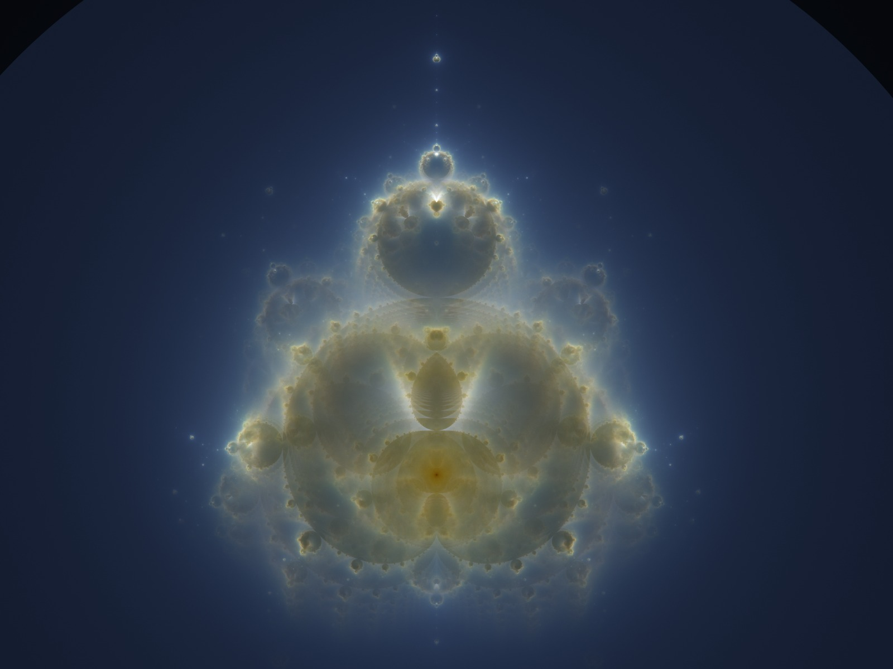

# buddhabrot-cuda

A CUDA Buddhabrot renderer with multi-GPU support, 16-bit HDR PNG output, and a separable post-process tonemap stage.



A 16-bit, 16384 × 12288 hero render of the Mandelbrot Buddhabrot at the
classical "seated buddha" pose, rendered from 1024 billion samples on a single
RTX 4070 Ti SUPER in 67 minutes.

## What this is

The [Buddhabrot](https://en.wikipedia.org/wiki/Buddhabrot) is a histogram of
orbit trajectories of points that escape the Mandelbrot set. This repo is a
CUDA C++ implementation of the algorithm, ported from the WGSL reference
shaders in [TheCymaera/buddhabrot](https://github.com/TheCymaera/buddhabrot)
and extended for offline batch rendering at gallery resolutions.

Key features:

- **GPU compute shader.** Single CUDA kernel iterates orbits and atomic-adds
  into a per-channel histogram. Multicolor output via three iteration thresholds
  for R/G/B channels (the classic "Nebulabrot" trick).
- **Multi-GPU.** One independent histogram per device, P2P-merged at the end.
  Tested up to 8 H200s. Single-GPU is the same code path.
- **uint64 seed mixing.** PCG-XSH-RR-64→32 hashing avoids RNG-stream
  correlations at the 10¹⁰⁺ thread-launch scale that big multi-GPU renders hit.
- **`z²` fast path.** When `exponent == (2, 0)` (Mandelbrot mode), `complex_pow`
  reduces to `(x²−y², 2xy)` — a ~10× speedup over the generic version that
  uses `sqrt`/`atan2`/`log`/`pow`/`exp`/`cos`/`sin`.
- **16-bit HDR PNG output.** Uses [LodePNG](https://github.com/lvandeve/lodepng)
  for clean 16-bit RGB encoding. Lossless dynamic range is preserved through to
  the printer.
- **Separable colorgrade post-process.** A small Python script applies
  per-channel "trim" multipliers in HDR space without re-rendering, equivalent
  to re-running the tonemap with adjusted normalization. Lets you tune the
  blue/green/red balance in seconds against a 1 GB raw PNG.

## Build

### Windows (CUDA + Visual Studio 2022)

```powershell
build.bat
```

Compiles for `sm_89` (Ada Lovelace). Produces `buddhabrot.exe`.

### Linux (cloud-friendly fat binary)

```bash
chmod +x build.sh
./build.sh
```

Builds `buddhabrot` with code for `sm_80` (A100), `sm_86` (3090/A40),
`sm_89` (4090/4070 Ti), and `sm_90` (H100/H200). Same binary runs on all four.

## Render the default scene

The default flags reproduce the screenshot composition:

- viewCenter = (−0.5935417456742, 0.04166264380232)
- zoom = 0.5
- rotation = 90°
- exponent = (2, 0) (classic z² Mandelbrot)
- iter R/G/B = 2000 / 200 / 20
- gamma = 4, normalizationFloor = 15

```bash
# Local single-GPU (Windows)
run.bat

# Local single-GPU (Linux)
./buddhabrot --output buddhabrot.png

# 8× H200 cloud render targeting ~25 trillion samples in ~2 hours
./run-cloud.sh
```

## Color-grade post-process

The renderer outputs the raw 16-bit Buddhabrot histogram, normalized only by
the per-channel maximum (no creative grading). To match a specific tone (e.g.
the "deep blue background" preset), apply per-channel trim multipliers:

```bash
python src/colorgrade.py input.png output.png \
    --trim-r 0.2673 --trim-g 0.2051 --trim-b 0.1270
```

Trim values < 1 reduce a channel's effective max → that channel gets brighter
in dim regions (compressed gamma curve over a smaller numerator). Per-channel
trims let you push the background blue or warm without affecting bright
saturated regions.

The trim values are derived from a target effective-max triple. The ones
above target `(R 49,332 / G 34,610 / B 20,086)` — the channel maxes of the
original screenshot's tone, derived from a 1024² render. That target is
sample-count invariant: if you re-render at 4× more samples, the raw maxes
quadruple but the trim values stay the same and produce the same tone.

## Performance

Validated on an RTX 4070 Ti SUPER (16 GB, sm_89):

| Resolution | Samples | Iter caps | Compute time | Sample rate |
|---|---|---|---|---|
| 1024 × 768 | 1 B | 2000/200/20 | 3.5 s | 305 M / s |
| 4096 × 3072 | 16 B | 2000/200/20 | 128 s | 125 M / s |
| 16384 × 12288 | 256 B | 2000/200/20 | 19 min | 240 M / s |
| 16384 × 12288 | 1024 B | 2000/200/20 | 67 min | 254 M / s |

Multi-GPU scaling is near-linear because the only cross-device communication
is the final histogram merge (~7 × 2.4 GB peer copies + sum kernels, total
~3 s on NVLink). Estimated 8× H200 throughput: ~3.4 G samples/s aggregate,
i.e. **~25 trillion samples in 2 hours** of compute.

## CLI reference

```
--width N                  output width                   (default 16384)
--height N                 output height                  (default 12288)
--samples N                total samples                  (default 256e9)
--output PATH              output PNG path                (default buddhabrot.png)
--iter-r N                 red   max iterations           (default 2000)
--iter-g N                 green max iterations           (default 200)
--iter-b N                 blue  max iterations           (default 20)
--view-center-x F          camera real component          (default -0.5935417456742)
--view-center-y F          camera imaginary component     (default  0.04166264380232)
--zoom F                   camera zoom                    (default 0.5)
--rotation-deg F           camera rotation in degrees     (default 90)
--blocks N                 CUDA blocks per launch         (default 4096)
--threads N                CUDA threads per block         (default 256)
--samples-per-thread N     samples per thread per launch  (default 1024)
--base-seed N              RNG base seed (uint64)         (default time-derived)
--devices N                GPUs to use (0 = all)          (default 0)
--launches-per-round N     sync/report cadence            (default 8)
```

## Algorithm notes

The core loop ports `compute.wgsl` from the upstream project. For each random
sample point `c` drawn from a disk centered at the origin, the kernel
iterates `z ← z^e + c` until `|z| > bailout` or the iteration cap is reached.
If the orbit escaped (`anti = false` mode) or stayed bounded (`anti = true`),
the kernel re-runs the orbit and atomically increments three histogram
channels at each visited pixel — channel 0 (R) for `i ≤ iterMaxR`, channel 1
(G) for `i ≤ iterMaxG`, channel 2 (B) for `i ≤ iterMaxB`. This produces the
characteristic multicolor Nebulabrot effect: long-lived orbits illuminate
deep filaments only in the channel with the highest cap, while short orbits
contribute uniformly to all three.

The tonemap divides each pixel's count by its channel's per-render max
(clamped from below by `normalizationFloor`), then applies an
`output = 1 − (1 − t)^gamma` curve. This compresses bright regions and
preserves dim filament detail without per-channel exposure tuning.

## Credits

- Original WGSL implementation and UI: [TheCymaera/buddhabrot](https://github.com/TheCymaera/buddhabrot).
- Buddhabrot algorithm: Lori Gardi (1993, "Anti-Buddhabrot"), Melinda Green
  (popularization). [Wikipedia](https://en.wikipedia.org/wiki/Buddhabrot).
- 16-bit PNG codec: [LodePNG](https://github.com/lvandeve/lodepng) by
  Lode Vandevenne, vendored under its zlib license in `src/lodepng.{h,cpp}`.
- Color-grade post-process: numpy + OpenCV in `src/colorgrade.py`.

## License

The CUDA renderer code in this repo is MIT-licensed. See `LICENSE`.
LodePNG retains its original zlib license.
